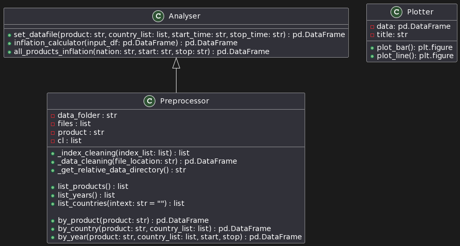

# <u>Software Architecture and Design</u>

## <u>Overview</u>

This project is named as Global Inflation Analyzer (GIA). It is a python library, and written to give a comprehensive analysis of inflation rate. The library can be used to perform analysis based on a given dataset with the classification standard of classification of individual consumption by purpose (COICOP 2-5-digit hierarchy). 

## <u>Architecture</u>

<div>

</div>

$\hspace{10cm}$

The image shown above represents a simple architecture diagram depicting three classes: `Preprocessor`, `Analyser`, and `Plotter`. Each class has its attributes and methods, and there is a relationship between the `Analyser` and `Preprocessor` classes.

1. **Preprocessor Class**:
   - Attributes:
     - `data_folder`: A string representing the directory path for data.
     - `files`: A list containing file paths in the data folder.
     - `product`: A string representing the selected product.
     - `cl`: A list containing the selected countries.

   - Methods:
     - `_index_cleaning(index_list: list)`: Takes a list of DataFrame indexes, cleans the strings, and returns the cleaned list.
     - `_data_cleaning(file_location: str)`: Reads a data set from the provided file location, cleans the column headers and indexes, and returns the cleaned DataFrame.
     - `_get_relative_data_directory()`: Returns the relative path of the data directory.
     - `list_products()`: Lists all available product entries from data files.
     - `list_years()`: Lists all available years from the data for the selected product and countries.
     - `list_countries(intext: str = "")`: Lists all available countries from the data, optionally filtered by a specific string.
     - `by_product(product: str)`: Returns the DataFrame for the selected product.
     - `by_country(product: str, country_list: list)`: Returns the DataFrame with data for the selected product and countries.
     - `by_year(product: str, country_list: list, start, stop)`: Returns the DataFrame with data for the selected product, countries, and specified time range.

2. **Analyser Class**:
   - Methods:
     - `set_datafile(product: str, country_list: list, start_time: str, stop_time: str)`: Sets data for the Analyser by using the Preprocessor class methods to filter data based on product, countries, and time range.
     - `inflation_calculator(input_df: pd.DataFrame)`: Calculates the inflation rate for the given DataFrame and returns a new DataFrame with inflation values for each time period.
     - `all_products_inflation(nation: str, start: str, stop: str)`: Merges inflation rates of all products for a given country within a specific period, using the Preprocessor and Analyser methods.

3. **Plotter Class**:
   - Attributes:
     - `data`: A Pandas DataFrame to be plotted.
     - `title`: A string representing the title of the plot.

   - Methods:
     - `plot_bar()`: Plots a bar chart using Matplotlib with data from the DataFrame and returns the plot figure.
     - `plot_line()`: Plots a line chart using Matplotlib with data from the DataFrame and returns the plot figure.

The relationship `Analyser <|-- Preprocessor` indicates that the Analyser class inherits from the Preprocessor class, forming an inheritance relationship. This means that the Analyser class can use the methods and attributes defined in the Preprocessor class.

## <u>Technology Stack</u>

- Python `Version 3.8.10`
- Numpy `Version 1.22.0`
- Pandas `Version 1.3.5`
- Matplotlib `Version 3.5.1`

## <u>Design Pattern</u>

The package provides three classes: `Preprocessor`, `Analyser`, and `Plotter`. It shows a relationship between `Analyser` and `Preprocessor`, where `Analyser` inherits from `Preprocessor`. The design pattern is as follows: 

### Inheritance (Analyser <|-- Preprocessor):
 **Inheritance** is a fundamental Object-Oriented Programming (OOP) concept, where a class (subclass) inherits properties and behaviors from another class (superclass).

- `Analyser` is the **subclass**, and it inherits from `Preprocessor`, which is the **superclass**. This relationship is indicated by the arrow `<|--`.

**Inheritance is used for the following reasons:**

1. Code Reusability: By inheriting from the `Preprocessor` class, the `Analyser` class can reuse all the methods and attributes defined in the `Preprocessor` class. This avoids duplicating code and promotes code reuse.

2. Specialization: The `Analyser` class specializes the functionality of the `Preprocessor` class by adding specific methods like `set_datafile`, `inflation_calculator`, and `all_products_inflation`. This allows `Analyser` to provide additional functionality while leveraging the data cleaning and filtering capabilities of the `Preprocessor` class.

In summary, the design pattern is **Inheritance**, which facilitates code reusability and promotes specialization of classes in an Object-Oriented system.

## <u>Data Flow</u>

### A. Preprocessor Class

##### 1. Constructor (`__init__`):

- The `Preprocessor` class initializes by setting the **data_folder** attribute using the `_get_relative_data_directory()` method, which obtains the relative data directory path.
- The **files** attribute is set by creating a list of file paths within the data_folder using the os.listdir function and a list comprehension.

##### 2. Index Cleaning (`_index_cleaning()`):

- The `_index_cleaning()` method takes a list of DataFrame indexes as input. It cleans the indexes by capitalizing the countries, trimming edges and removing spaces.
- The cleaned index list is returned to the calling function.

##### 3. Data Cleaning (`_data_cleaning()`):

- The `_data_cleaning()` method takes a file location as input.
- It reads the specified data file, whether in Excel (.xlsx) or CSV (.csv) format, using pandas.
- The column headers are cleaned and converted to snake_case format, and the indexes are cleaned using the `_index_cleaning()` method.
- The cleaned DataFrame is returned.

##### 4. List Products (`list_products()`):

- The `list_products()` method returns a list of available products present in the data files.
- It iterates through the files attribute and extracts the product names from the file names by splitting on specific patterns.

##### 5. By Products (`by_product()`):

- The `by_product()` method takes the desired product as input and checks if it exists in the list of available products.
- If the product is found, it retrieves the data for that product using the `_data_cleaning()` method.
- The cleaned DataFrame for the selected product is returned.

##### 6. List Countries (`list_countries()`):

- The `list_countries()` method returns a list of all available countries present in the data files.
- Optionally, it accepts a string intext to filter the countries based on a specific text.
- It also provides an option to return countries grouped by regions if the intext matches specific region names.

##### 7. By Country (`by_country()`):

- The `by_country()` method takes the desired product and a list of countries as input.
- It retrieves the data for the selected product using the `by_product()` method and then filters it based on the given country list.
- The cleaned DataFrame with the selected product and countries is returned.

##### 8. List Years (`list_years()`):

- The `list_years()` method returns a list of available years present in the data files for the 'Education' product.
- It achieves this by calling the `by_country()` method with the 'Education' product and the list of all european countries.

##### 9. By Year (`by_year()`):

- The `by_year()` method takes the desired product, a list of countries, start year, and stop year as input.
- It retrieves the data for the selected product and countries using the `by_country()` method.
- The data is then filtered to include only the columns within the specified range of start and stop years.
- The cleaned DataFrame with the selected product, countries, and specified years is returned.

The data flow in the Preprocessor class involves reading data files, cleaning the data (columns and indexes), and providing methods to filter data based on products, countries, and time periods.

### B. Analyser Class

##### 1. Inheritance from Preprocessor:

- The `Analyser class` inherits from the `Preprocessor class`. This inheritance allows the `Analyser class` to access the methods and attributes of the `Preprocessor` class, enabling data preprocessing and filtering.

##### 2. Set Datafile (`set_datafile`):

- The `set_datafile` method takes the following inputs:
    * `product`: The desired product to be analyzed.
    * `country_list`: A list of countries to be analyzed.
    * `start_time`: The starting time or reference month for the analysis.
    * `stop_time`: The last month of the analysis period.
- The method sets the instance attributes `product`, `country_list`, `start_time`, and `stop_time` based on the input parameters.
- It then calls the `by_year` method inherited from the `Preprocessor class` to retrieve the data for the selected product, countries, and time period.
- The cleaned DataFrame containing the selected data is stored in the `data` instance attribute and also returned by the method.

##### 2. Inflation Calculator (`inflation_calculator`):

- The `inflation_calculator` method takes a well-formulated DataFrame `input_df` as input. This DataFrame is expected to be the result of previous functions and ready for analysis.
- The method calculates the inflation rate for each column in the DataFrame using the given formula.
- It creates new columns in the DataFrame with the calculated inflation rates for each time period.
- The DataFrame with the added inflation columns is returned as inflation_result.

##### 3. All Products Inflation (`all_products_inflation`):

- The `all_products_inflation` method calculates the inflation rates for all products available in a specific country during a given time period.
- The method takes the following inputs:
    * `nation`: The name of the country for which inflation rates are to be calculated.
    * `start_time`: The starting time or reference month for the analysis.
    * `stop_time`: The last month of the analysis period.
- The method retrieves the list of available products using the `list_products` method inherited from the `Preprocessor` class.
- It initializes an empty DataFrame `resultframe` to store the calculated inflation rates for all products.
- The method iterates over each product in the `product_list` and calls the `set_datafile` method to get the data for that product, country, and time period.
- The result DataFrame for each product is appended to `resultframe`.
- The index of `resultframe` is updated to include the product names for better identification.
- The final `resultframe` DataFrame containing inflation rates for all products and the specified country is returned.

The data flow in the `Analyser` class involves retrieving data from the `Preprocessor` class, calculating inflation rates, and merging the results for various products and a specified country over a specific time period. The class leverages the functionalities provided by the `Preprocessor` class to achieve data cleaning, filtering, and analysis.

### C. Plotter Class

The `Plotter` class is responsible for plotting bar charts and line charts based on the provided data. The class has two main methods, `plot_bar()` and `plot_line()`, each returning a `matplotlib.figure.Figure` object.

##### 1. Initialization (`__init__`):
   - The constructor `__init__` initializes the `Plotter` object with the following parameters:
     - `data`: A Pandas DataFrame containing the data to be plotted.
     - `title`: A string representing the title of the plot.
   - The `data` and `title` attributes are set based on the provided parameters to be used in the plotting methods.

##### 2. Plot Bar Chart (`plot_bar()`):
   - The `plot_bar()` method plots a bar chart based on the data in the `data` attribute.
   - It transposes the DataFrame `data` to get the data in the required format for plotting.
   - The x-axis ticks (`x_ticks`) are set to be the index of the transposed DataFrame.
   - A figure with a size of 12x6 inches is created using `plt.figure(figsize=(12, 6))`.
   - A bar chart is plotted for each column (country) in the transposed DataFrame. The bars are stacked on top of each other using the `bottom` parameter to accumulate the values of previous bars.
   - The plot is customized with labels, titles, legends, and grid lines using various `matplotlib.pyplot` functions.
   - The plot is returned as a `matplotlib.figure.Figure` object using `plt.gcf()`.

##### 3. Plot Line Chart (`plot_line()`):
   - The `plot_line()` method plots a line chart based on the data in the `data` attribute.
   - It transposes the DataFrame `data` to get the data in the required format for plotting.
   - The x-axis ticks (`x_ticks`) are set to be the columns of the transposed DataFrame.
   - A figure with a size of 12x6 inches is created using `plt.figure(figsize=(12, 6))`.
   - A line chart is plotted for each column (country) in the transposed DataFrame.
   - The plot is customized with labels, titles, legends, and grid lines using various `matplotlib.pyplot` functions.
   - The plot is returned as a `matplotlib.figure.Figure` object using `plt.gcf()`.

The data flow in the `Plotter` class involves receiving the data to be plotted during initialization, and then using this data to generate bar charts or line charts based on the user's choice. The class uses the `matplotlib` library for plotting and returns the plot as a `matplotlib.figure.Figure` object, which can be further displayed or saved if needed.

---

## User Interface

The user interacts with the software from a **jupyter notebook (.ipynb)** file placed in the bin folder. Some examples are given below :

### Example 1: List Available Products

```python
from preprocessor import Preprocessor

preprocessor = Preprocessor() 

products_list = preprocessor.list_products()
print(f"Available products:{products_list}")
```

### Example 2: Select Data for a Specific Product

```python
from preprocessor import Preprocessor

preprocessor = Preprocessor()

selected_product = "Education"

product_data = preprocessor.by_product(selected_product)

print("Data for the selected product:")
product_data.head()
```

### Example 3: List Available Countries

```python
from preprocessor import Preprocessor

preprocessor = Preprocessor()

countries_list = preprocessor.list_countries()

print(f"Available countries: \n{countries_list}")
```

### Example 4: Select Data for Specific Countries

```python
from preprocessor import Preprocessor

preprocessor = Preprocessor()

selected_product = "Food"

selected_countries = ["United_States","United_Kingdom","Canada","Germany","Spain"]

countries_data = preprocessor.by_country(selected_product, selected_countries)

print(f"Data for the selected countries: ")
countries_data.head()
```

### Example 5: List Available Years

```python
from preprocessor import Preprocessor

preprocessor = Preprocessor()

years_list = preprocessor.list_years()

print(f"Available years: \nStart: {years_list[:5]}\nEnd: {years_list[-5:]}")
```

### Example 6: Select Data for Specific Years

```python
from preprocessor import Preprocessor

preprocessor = Preprocessor()

selected_product = "Clothing"

selected_countries = ["United_States","United_Kingdom","Canada","Germany","Spain"]

start_year = "Mar_2012"
stop_year = "Sep_2018"

years_data = preprocessor.by_year(selected_product, selected_countries, start_year, stop_year)

print(f"Data for the selected years: \n")
years_data.head()
```
The examples demonstrate how to interact with the `Preprocessor` class to perform data cleaning and filtering operations.

---
Here are the user examples for the `Analyser` class in Jupyter Notebook cells:

### Example 7: Calculate Inflation Rate for a Specific Dataset

```python
from analysis import Analyser

analyser = Analyser()

product = "Education"
country_list = ["United_States", "Canada"]
start_time = "Jan_2022"
stop_time = "Dec_2022"

data = analyser.set_datafile(product, country_list, start_time, stop_time)

inflation_result = analyser.inflation_calculator(data)

print("Inflation Rate:")
inflation_result.head()
```

### Example 8: Merge Inflation Rate of All Products for a Specific Country

```python
from analysis import Analyser

analyser = Analyser()

country = "Spain"
start_time = "Jan_2019"
stop_time = "Dec_2022"

# Calculate inflation rate for all products in the specified country and time period
inflation_by_product = analyser.all_products_inflation(country, start_time, stop_time)

print("Inflation Rate for All Products in", country)
inflation_by_product.head()
```
---
Here are the user examples for the `Plotter` class in Jupyter Notebook cells:

### Example 9: Plot Bar Chart

```python
from analysis import Analyser
from plotter import Plotter
import matplotlib.pyplot as plt

analyser = Analyser()

country = "United_States"
start_time = "Jan_2022"
stop_time = "Dec_2022"

inflation_data = analyser.all_products_inflation(country,
                                                 start_time, stop_time)

plotter = Plotter(inflation_data, title=f"Inflation Rate by of products in {country}")

bar_chart = plotter.plot_bar()

plt.show()
```

### Example 10: Plot Line Chart

```python
from analysis import Analyser
from plotter import Plotter
import matplotlib.pyplot as plt

analyser = Analyser()

product = "Housing_Energy"
country_list = ["United_States","United_Kingdom","Canada","Germany","Spain"]
# Enter one time period before the desired input, 
# e.g. enter Dec_2021 if you want data starting from Jan_2022
start_time = "Dec_2019" 
stop_time = "Dec_2022"

data = analyser.set_datafile(product,country_list,
                            start_time,stop_time)

inflation_data = analyser.inflation_calculator(data)
            
plotter = Plotter(inflation_data, title="Inflation Rate by Country")

line_chart = plotter.plot_line()

plt.show()
```

In these examples, we demonstrate how to use the `Plotter` class to plot bar charts and line charts for inflation rate data. The `plt.show()` function is used to display the generated charts in the Jupyter Notebook.

## <u>Testing Strategy</u>


## <u>Future Improvements</u>

In the future, we could make it so that the User can choose various products and nations simultaneously for the purpose of their analysis.


